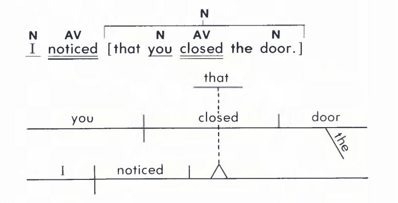
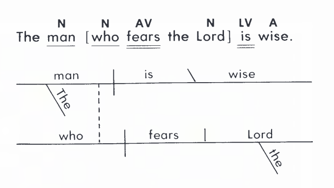
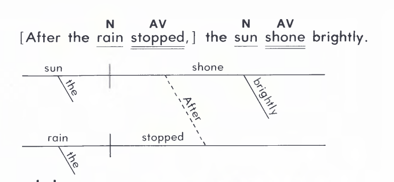

# Complex sentence
A complex sentence has one independent clause and one or more dependent clause.

A dependent clause may be a noun, adjective, or adverb clause.

## Noun clause
**Words that introduce noun clauses:**
```
how     what        when    which       who     whose
that    whatever    where   whichever   whoever why
```


- I noticed [that you closed the door.]

## Adjective clause
**Relative pronouns that introduce adjective clauses:**
```
who whom    whose   which   that
```


## Adverb clause
**Subordinating conjunctions that introduce adverb clauses:**
```
after       as though   how     though  whenever
although    because     since   unless  where
as          before      so that until   wherever
as if       if          than    when    while
```

